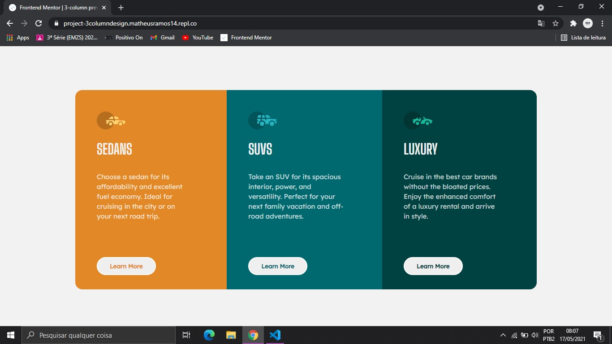
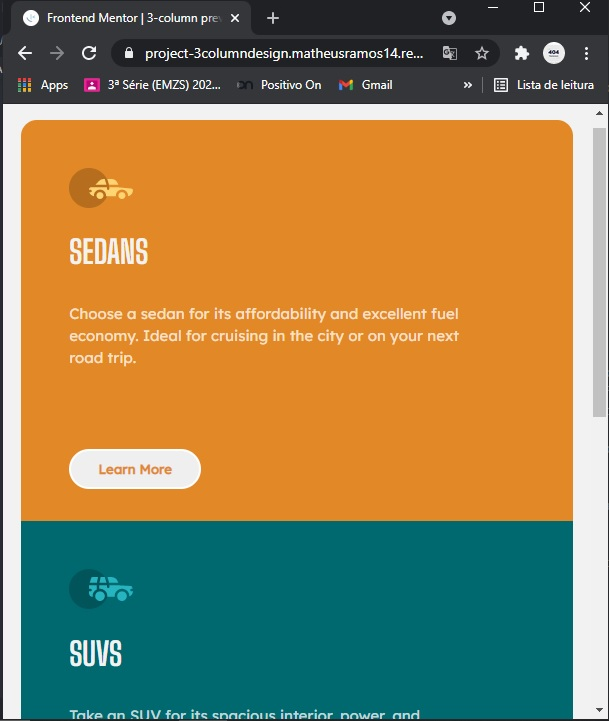

# Frontend Mentor - 3-column preview card component solution

This is a solution to the [3-column preview card component challenge on Frontend Mentor](https://www.frontendmentor.io/challenges/3column-preview-card-component-pH92eAR2-). Frontend Mentor challenges help you improve your coding skills by building realistic projects.

## Table of contents

- [Frontend Mentor - 3-column preview card component solution](#frontend-mentor---3-column-preview-card-component-solution)
  - [Table of contents](#table-of-contents)
  - [Overview](#overview)
    - [The challenge](#the-challenge)
    - [Screenshot](#screenshot)
    - [Links](#links)
  - [My process](#my-process)
    - [Built with](#built-with)
    - [What I learned](#what-i-learned)
  - [Author](#author)

## Overview

### The challenge

Users should be able to:

- View the optimal layout depending on their device's screen size
- See hover states for interactive elements

### Screenshot

Desktop screen design:



Mobile screen design:



### Links

- Solution URL: [My GitHub Repo](https://github.com/MatheusRamos14/FM-3columncardproject)
- Live Site URL: [My Repl.co site](https://project-3columndesign.matheusramos14.repl.co/)

## My process

### Built with

- Semantic HTML5 markup
- CSS custom properties
- CSS Box-Model

### What I learned

```css
/* I've learned about CSS specificity in practice, so, I had to use "!important" key*/

.card-button:hover {
    background: inherit;
    
    color: hsl(0, 0%, 95%) !important;
}

/* Now, I promise to take more care about that problem at my next projects.*/
```

## Author

- GitHub - [MatheusRamos14](https://github.com/MatheusRamos14/)
- Frontend Mentor - [@MatheusRamos14](https://www.frontendmentor.io/profile/MatheusRamos14)
- Rocketseat - [Matheus Ramos](https://app.rocketseat.com.br/me/matheus-da-silva-ramos-1584904352)
